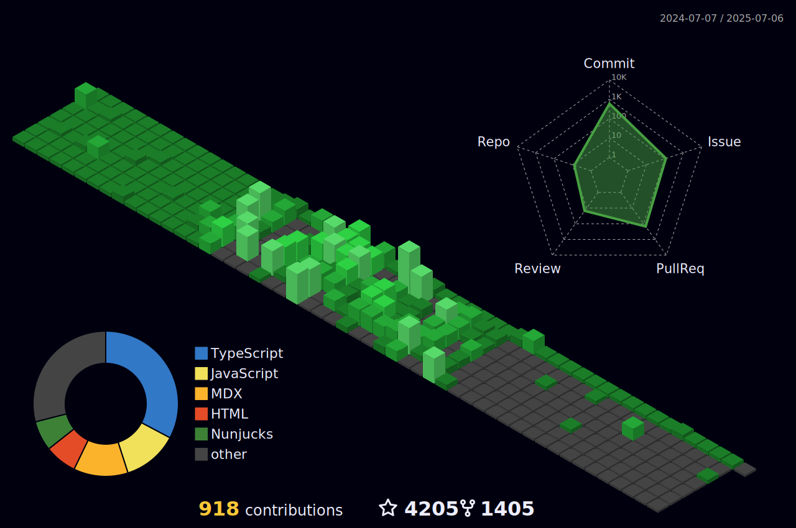

# 👋 Welcome to MZP's GitHub

Meet **Irfan** a.k.a `mazipan`, Web developer from 🇮🇩 with 10+ years of experiences in the E-Commerce industry. Working with `JS` or `TS`, familiar with multiple web frameworks such as `react`, `svelte` or `vue`. Now working at [GovTech Edu](https://www.govtechedu.id/), Ex [@sayurbox](https://github.com/sayurbox), [@tokopedia](https://github.com/tokopedia), Bizzy Indonesia, [@bliblidotcom](https://github.com/bliblidotcom), & SML Technologies. Helping OSS projects in [PHPID](https://github.com/phpid-jakarta), [React.js ID](https://twitter.com/reactjsid), [KawalCovid19](https://github.com/kawalcovid19), and many more.

## 🔗 Connect with me

 
 

## 💸 Support me:

I have monthly income from my full-time employment, but you can always support me to pay some of projects those require domain subscription or just to buying some snacks or tea.

- 👉 🇮🇩 [Trakteer](https://trakteer.id/mazipan/tip?utm_source=github-mazipan)
- 👉 🌍 [BuyMeACoffe](https://www.buymeacoffee.com/mazipan?utm_source=github-mazipan)
- 👉 🌍 [Paypal](https://www.paypal.me/mazipan?utm_source=github-mazipan)
- 👉 🌍 [Ko-Fi](https://ko-fi.com/mazipan?utm_source=github-mazipan)

## 📊 Stats

 
Full Stats (click me to toggle 👀)

  
 

  
 

 

 

 

 

  

