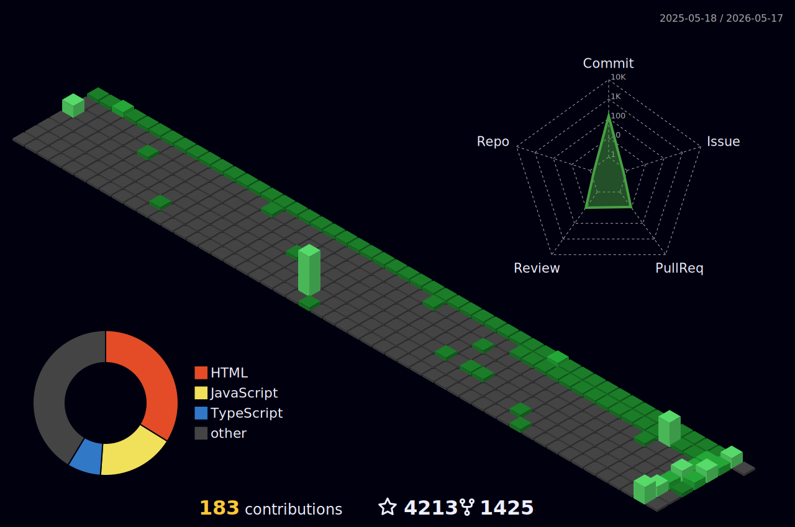

# 👋 Hi, I'm Irfan (mazipan)

Web developer from 🇮🇩 with **10+ years of experience** in the E-Commerce industry.
I work primarily with `JavaScript` and `TypeScript`, and I'm comfortable across multiple frameworks including `React`, `Svelte`, and `Vue`.

---

## 💼 Experience

Currently at **Wego** · [@mazipan-wego](https://github.com/mazipan-wego)

Previously at:
[GovTech Edu](https://www.govtechedu.id/) · [@sayurbox](https://github.com/sayurbox) · [@tokopedia](https://github.com/tokopedia) · Bizzy Indonesia · [@bliblidotcom](https://github.com/bliblidotcom) · SML Technologies

---

## 🤝 Open Source

Active contributor and community helper in:
[PHPID Jakarta](https://github.com/phpid-jakarta) · [React.js ID](https://twitter.com/reactjsid) · [KawalCovid19](https://github.com/kawalcovid19) · and more

---

## 🔗 Connect

  
  

---

## ☕ Support

If you find my work useful, consider buying me a tea or helping with domain costs:

- 🇮🇩 [Trakteer](https://trakteer.id/mazipan/tip?utm_source=github-mazipan)
- 🌍 [PayPal](https://www.paypal.me/mazipan?utm_source=github-mazipan)

---

## 📊 Stats

  
View full stats 👀

   
  

  

  

